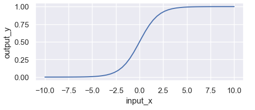
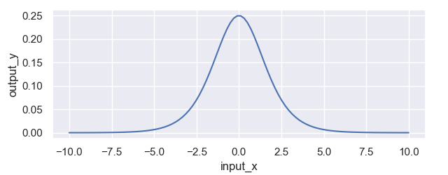
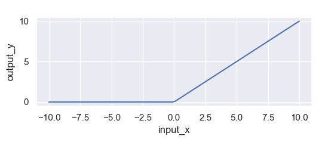
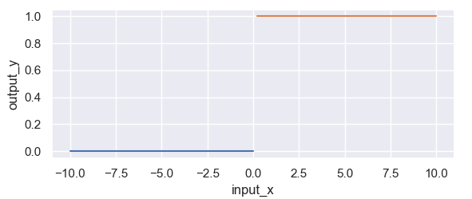
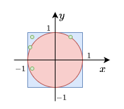

# 深度学习基础
## 激活函数的作用
为什么要在网络中引入激活函数？如果不引入激活函数那么我们的网络是这个样子的$f(x)=A(B(CX))=ABCX=DX,ABC=D$。那么，我们的神经网络的就变成了一个线性函数，是空间中的一个超平面，大大限制了神经网络的拟合能力。激活函数就是给神经网络引入非线性，使得神经网络可以拟合各种复杂函数。那么任何激活函数可以随便选择吗？

### Sigmoid
* 函数公式：

$$f(x)=\frac{1}{1+e^{-x}}$$

* 导数公式：

$$f^{'}(x)=f(x)(1-f(x))$$

* 优点
    * 函数平滑、易于求导
    * 可直接作为分类模型的输出

* 缺点
    * 计算量大，包含幂运算，以及除法运算；
    * sigmoid 导数的取值范围是 [0, 0.25]，最大值都是小于 1 的，反向传播时又是"链式传导"，经过几次相乘之后很容易就会出现梯度消失的问题，不利于模型加深；
    * sigmoid 的输出的均值不是0（即zero-centered），这会导致当前层接收到上一层的非0均值的信号作为输入，随着网络的加深，会改变数据的原始分布，不利于模型的收敛。

### Tanh

### ReLU
ReLU 全称为 Rectified Linear Unit，即修正线性单元函数。该函数的公式比较简单，相应的公式和图像如下表所示。
* 函数公式

$$ReLU(x)=\begin{cases}  
0 & if & x \leq 0\\
x & if & x > 0 
\end{cases}$$

* 导函数公式

$$ReLU(x)=\begin{cases}  
0 & if \; x \leq 0\\
1 & if \; x > 0 
\end{cases}$$

## 蒙特卡洛算法

#### 例子1:估计圆周率的值

如下图所示，从正方形中随机均匀抽取点$(x,y)$，那么$(x,y)$落在圆内的概率是多少？

圆的面积： $S_c = \pi r^2=\pi$ 

正方形的面积： $S_q = 2^2=4$ 

概率： $P = \frac{\pi}{4}$ 

假设我们采样了 $n$ 个点，利用圆的方程 $(x-x_o)^2+(y-y_o)<1$ ，统计后有 $m$ 个点落在圆内，因此我们得到
$$\frac{m}{n}\approx\frac{\pi}{4}=>\pi\approx\frac{4m}{n}$$
根据大数定律，当n的值越大， $\frac{4m}{n}$ 越接近 $\pi$ 。

#### 例子2: 近似求积分（integral）
求函数 $f(x)$ 的定积分 $I=\int^b_af(x)dx$ ，当 $f(x)$ 是一个简单函数，那么我们容易求得其原函数，从而求得其准确的定积分。如果 $f(x)=\frac{1}{1+sin(x)(log_ex)^2}$ 或者是其他复杂函数，怎么求呢？这种情况很难求得其准确值，只能求近似解，蒙特卡洛算法就是一个求得其近似解的可选方法。

步骤1. 从区间[a,b]均匀采样 $n$ 个数值记作 ${x_1,x_2,...,x_n}$ .

步骤2. 计算 $Z_n=(b-a)*\frac{1}{n}\sum_{i=1}^{n}f(x_i)$ 

步骤3. $Z_n$ 可以作为 $I=\int^b_af(x)dx$ 的估计值，当$n$的取值越大 $Z_n$ 越接近真实值 $I$ 

### 例子3: 近似期望
统计学习和机器学习中经常使用

$X$： $d$ 维的随机向量

$p(x)$: 概率密度函数（PDF），️以随机向量 $x$ 作为输入，输出其概率。其中 $\int_{x \in X}p(x)dx=1$ 

$f(x)$ :是任意函数，以随机向量 $x$ 作为输入。

期望: $\mathbb{E}=\int_{x \in X}f(x)p(x)dx$ 

近似步骤：

* 根据概率密度函数 $p(x)$ ，采样 $n$ 个样本记作 $x_1,x_2,...,x_n$ .

* 计算 $Z=\frac{1}{n}\sum_{i=1}^nf(x_i)$ 

* 将 $Z$ 作为期望 $\mathbb{E}_{X}[f(x)]$

样本数量 $n$ 越大估计结果越准确。

蒙特卡洛算法是利用样本对数据进行估计的算法，其估计结果并不是准确值，得到的结果只是近似值。

