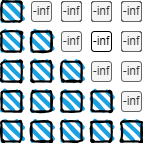

# LLM 模型结构

## Tokenization


## Position Embedding

## Normalization

## Attention

在自然语言处理任务中，通过引入Attention机制实现动态的根据上下文中的具体信息计算当前字符的表示。当前字符的表示是上下文字符表示加权求和的结果。一般Attention的计算流程如下：
*  计算查询（Query）、键（Key）、值（Value）
*  利用Query和Key计算相关性分数，最后通过Softmax函数进行归一化得到注意力权重
*  通过注意力权重对Value加权求，得到最后的表示。
  
### 主流Attention

#### 1. Scaled Dot-Product Attention

$$Attention(Q,K,V)=softmax(\frac{QK^T}{\sqrt{d}})V$$

* 对于输入的词向量序列 $X$，首先通过矩阵转换获得 $Q$ 、 $K$ 、 $V$ 
* 利用 $Q$ 、 $K$ 计算相关性分数,并对分数进行缩放 $\frac{QK^T}{\sqrt{d}}$ ,其中 $d$ 为隐藏层的维度。缩放可以使得 $softmax$ 的输出更加平滑，使得模型更容易收敛。试想如果某个维度的分数过大，导致模型对该维度的特征过于敏感，不利于模型的学习收敛。
* 利用softmax函数进行归一化处理,得到相关性分数 $score=softmax(\frac{QK^T}{\sqrt{d}})$
* 利用相关性分数加权求和得到每个位置的token表示。

**ShowMetheCode**：
```
import torch
import torch.nn as nn
from dataclasses import dataclass
import math

@dataclass
class ModelConfig:
    batch_size: int = 6
    block_size: int = 8
    n_embd: int = 12
    n_head: int = 2

class SelfAttention(nn.Module):
    def __init__(self, config: ModelConfig):
        super().__init__()
        self.attn_w = nn.Linear(config.n_embd, 3*config.n_embd)
        self.proj_w = nn.Linear(config.n_embd, config.n_embd)
    
    def forward(self, x):
        # 计算Q，K，V
        qkv = self.attn_w(x) # [B, T, C]->[B, T, 3*C]
        q,k,v = qkv.split(x.shape[-1], dim=2) # [B, T, 3*C]->3*[B, T, C]
        # 计算相关性分数
        atten_score = q@k.transpose(-2,-1)/(1/math.sqrt(q.shape[-1]))#[B, T, T]
        # 归一化相关性分数
        atten_score = torch.softmax(atten_score, dim=-1)#[B, T, T]
        # 加权求和
        out = atten_score@v # [B, T, C]
        return self.proj_w(out)

```

#### 2. Multi-Head Attention(MHA)
MHA是Attention is All You Need这篇论文提出的对self-attention的一个改进，该算法通过将多个self-attention的计算结果拼接，得到最后的输出。由于需要保证拼接后的向量维度和输入向量的一致，因此每个头的维度小于输入向量的维度（ $dim_{input}=n_{head}*dim_{head}$ ）。多头注意力机制将原始输入信息映射到不同的向量子空间，有利于提升特征表示能力。

**ShowMeTheCode:**
```
import torch
import torch.nn as nn
from dataclasses import dataclass
import math

@dataclass
class ModelConfig:
    batch_size: int = 6
    block_size: int = 8
    n_embd: int = 12
    n_head: int = 2
        
class MHAttention(nn.Module):
    def __init__(self, config:ModelConfig):
        super().__init__()
        assert config.n_embd%config.n_head == 0,"参数设置错误"
        self.config = config
        self.attn_w = nn.Linear(config.n_embd, 3*config.n_embd)
        self.proj_w = nn.Linear(config.n_embd, config.n_embd)
        
    def forward(self,x):
        B, T, C = x.shape
        # 获取Q，K，V矩阵
        qkv = self.attn_w(x) # [B, T, C]->[B,T,3*C]
        q, k, v = qkv.split(self.config.n_embd, dim=-1)
        # [B, T, C]->[B, n_head, T, C/n_head]
        q = q.view(B, T, self.config.n_head, C//self.config.n_head).transpose(2,1)
        k = k.view(B, T, self.config.n_head, C//self.config.n_head).transpose(2,1)
        v = v.view(B, T, self.config.n_head, C//self.config.n_head).transpose(2,1)
        # 计算相关性分数
        attn_score = q@k.transpose(-2,-1)/(1/math.sqrt(C//self.config.n_head)) # [B, n_head, T, T]
        # 相关性分数归一化
        attn_score = attn_score.softmax(dim=-1)
        # 对v加权求和
        out = attn_score@v # [B, n_head, T, C/n_head]
        out = out.transpose(1,2).contiguous().view(B, T, C)
        return self.proj_w(out)

```

#### 3. MHA+MASK实现CasualSelfAttention
上述Attention每个字符的表示通过聚合整个输入序列的字符，然而在因果语言模型（Casual Language Model）中，每个字符只能观测到其自身以及前面的字符，这主要通过MASK机制实现。如下图所示：



MASK机制主要通过将注意力分数（未归一化）的上三角矩阵元素设置为`-inf`实现。这样归一化后的注意力分数矩阵的上三角元素 $\approx 0$ 从而屏蔽掉当前token的后面的tokens。

**ShowMeTheCode:**
```

```

**ShowMeTheCode(Flash_attention版本):**
```

```

#### 4. Flash Attention


#### 5. Multi-Query Attention


#### 6. Grouped Query Attention


