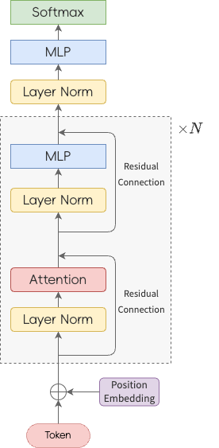

# LLM 模型结构


## 一、Tokenization
对于深度学习模型来说，处理文本时的基本单元叫做Token (词元)，一个token可以包括多个词或者字。粒度太大会造成此表过大，粒度太小会损失语义信息。

## 二、Position Embedding
通过对Attention的介绍，我们发现Attention是位置不敏感的，它同等的对待每个位置的Token。例如 `天气晴朗，适合露营` 和 `露营晴朗，适合天气` 两句话中的每个词的表示是一致的。然而现实中，第二句话基本不会被使用，对于语言模型来说，第一个句子的概率应该大于第二句话。但是基于Attention的语言模型对两句话分配的概率相等。因此，为了区分开两句话，需要加入位置信息。加入位置信息的方式大致分为两种：
* 将位置信息加入到输入词序列中--**绝对位置编码**
* 通过修改Attention，使得Attention能动态识别不同的位置的Token--**相对位置编码**

### 绝对位置编码

#### 1. 训练式
BERT
#### 2. 函数式
Transformer Sinusoidal位置编码

### 相对位置编码

相对位置并没有完整建模每个输入的位置信息，而是在算Attention的时候考虑当前位置与被Attention的位置的相对距离，由于自然语言一般更依赖于相对位置，所以相对位置编码通常也有着优秀的表现。对于相对位置编码来说，它的灵活性更大。

#### 1. 旋转位置编码 RoPE
绝对位置编码在一定程度上解决了为位置问题，但是还存在一些问题：
* 缺少相对位置信息
* 当用户需要处理更长的文本时，需要重新训练，因此不具备外推的能力。

RoPE是如何解决这个问题的？

前置知识：

* 旋转矩阵

* 复数平面

Transformer对输入的处理过程如下：

$$q_m=f(q, m)$$
$$k_n=f(k, n)$$

$f$ 表示对输入向量添加位置信息，其中 $q$, $k$ 分布表示query向量和key向量；$q_m$, $k_n$ 表示添加了对应位置信息的向量。然后计算注意力分数：

$$a_{mn}=\frac{e^{(q_m \cdot k_n) / \sqrt{d}}}{\sum_{j=1}^{N}e^{(q_m \cdot k_j)/ \sqrt{d}}}$$

RoPE的思路是希望找到一个 $f$ 使得：

$$f(q, m) \cdot f(k, n)=\mathbb{g}(q,k,(m-n))$$

即：**通过函数 $f$ 对 $q$, $k$ 操作后的内积结果是 $q$, $k$ 相对位置的函数！！！**

为了简化问题，我们先假设词向量是二维的。作者借助复数来进行求解推导过程如下(省略)：

结果：

$$f(q,m)=R_mq=\left (\begin{matrix}
   \cos m \theta & -\sin m \theta  \\
   \sin m \theta & \cos  m \theta  
  \end{matrix}\right )q$$

结果显示，要找的这个 $f$是一个旋转矩阵，原来token间的相对位置可以用旋转矩阵表示。带入到 $f(q, m) \cdot f(k, n)$ 得到：

$$f(q, m) \cdot f(k, n)=(R_mq)^T \cdot R_nk=q^TR_{n-m}k$$

参考：

[图解RoPE旋转位置编码及其特性](https://mp.weixin.qq.com/s/-1xVXjoM0imXMC7DKqo-Gw)

[理解LLM位置编码:RoPE](https://zhuanlan.zhihu.com/p/684072868)

## 三、Attention

在自然语言处理任务中，通过引入Attention机制实现动态的根据上下文中的具体信息计算当前字符的表示。当前字符的表示是上下文字符表示加权求和的结果。一般Attention的计算流程如下：
*  计算查询（Query）、键（Key）、值（Value）
*  利用Query和Key计算相关性分数，最后通过Softmax函数进行归一化得到注意力权重
*  通过注意力权重对Value加权求，得到最后的表示。
  
### 主流Attention

#### 1. Scaled Dot-Product Attention

$$Attention(Q,K,V)=softmax(\frac{QK^T}{\sqrt{d}})V$$

* 对于输入的词向量序列 $X$，首先通过矩阵转换获得 $Q$ 、 $K$ 、 $V$ 
* 利用 $Q$ 、 $K$ 计算相关性分数,并对分数进行缩放 $\frac{QK^T}{\sqrt{d}}$ ,其中 $d$ 为隐藏层的维度。缩放可以使得 $softmax$ 的输出更加平滑，使得模型更容易收敛。试想如果某个维度的分数过大，导致模型对该维度的特征过于敏感，不利于模型的学习收敛。
* 利用softmax函数进行归一化处理,得到相关性分数 $score=softmax(\frac{QK^T}{\sqrt{d}})$
* 利用相关性分数加权求和得到每个位置的token表示。
* 代码
    ```python
    import torch
    import torch.nn as nn
    from dataclasses import dataclass
    import math

    @dataclass
    class ModelConfig:
        batch_size: int = 6
        block_size: int = 8
        n_embd: int = 12
        n_head: int = 2

    class SelfAttention(nn.Module):
        def __init__(self, config: ModelConfig):
            super().__init__()
            self.attn_w = nn.Linear(config.n_embd, 3*config.n_embd)
            self.proj_w = nn.Linear(config.n_embd, config.n_embd)
        
        def forward(self, x):
            # 计算Q，K，V
            qkv = self.attn_w(x) # [B, T, C]->[B, T, 3*C]
            q,k,v = qkv.split(x.shape[-1], dim=2) # [B, T, 3*C]->3*[B, T, C]
            # 计算相关性分数
            atten_score = q@k.transpose(-2,-1)*(1/math.sqrt(q.shape[-1]))#[B, T, T]
            # 归一化相关性分数
            atten_score = torch.softmax(atten_score, dim=-1)#[B, T, T]
            # 加权求和
            out = atten_score@v # [B, T, C]
            return self.proj_w(out)
    ```

#### 2. Multi-Head Attention(MHA)

* MHA是Attention is All You Need这篇论文提出的对self-attention的一个改进，该算法通过将多个self-attention的计算结果拼接，得到最后的输出。由于需要保证拼接后的向量维度和输入向量的一致，因此每个头的维度小于输入向量的维度（ $dim_{input}=n_{head}*dim_{head}$ ）。多头注意力机制将原始输入信息映射到不同的向量子空间，有利于提升特征表示能力。

* 代码
    ```python
    import torch
    import torch.nn as nn
    from dataclasses import dataclass
    import math

    @dataclass
    class ModelConfig:
        batch_size: int = 6
        block_size: int = 8
        n_embd: int = 12
        n_head: int = 2
            
    class MHAttention(nn.Module):
        def __init__(self, config:ModelConfig):
            super().__init__()
            assert config.n_embd%config.n_head == 0,"参数设置错误"
            self.config = config
            self.attn_w = nn.Linear(config.n_embd, 3*config.n_embd)
            self.proj_w = nn.Linear(config.n_embd, config.n_embd)
            
        def forward(self,x):
            B, T, C = x.shape
            # 获取Q，K，V矩阵
            qkv = self.attn_w(x) # [B, T, C]->[B,T,3*C]
            q, k, v = qkv.split(self.config.n_embd, dim=-1)
            # [B, T, C]->[B, n_head, T, C/n_head]
            q = q.view(B, T, self.config.n_head, C//self.config.n_head).transpose(2,1)
            k = k.view(B, T, self.config.n_head, C//self.config.n_head).transpose(2,1)
            v = v.view(B, T, self.config.n_head, C//self.config.n_head).transpose(2,1)
            # 计算相关性分数
            attn_score = q@k.transpose(-2,-1)/(1/math.sqrt(C//self.config.n_head)) # [B, n_head, T, T]
            # 相关性分数归一化
            attn_score = attn_score.softmax(dim=-1)
            # 对v加权求和
            out = attn_score@v # [B, n_head, T, C/n_head]
            out = out.transpose(1,2).contiguous().view(B, T, C)
            return self.proj_w(out)
    ```

#### 3. MHA+MASK实现CasualSelfAttention
* 上述Attention每个字符的表示通过聚合整个输入序列的字符，然而在因果语言模型（Casual Language Model）中，每个字符只能观测到其自身以及前面的字符，这主要通过MASK机制实现。如下图所示：

    

  MASK机制主要通过将注意力分数（未归一化）的上三角矩阵元素设置为`-inf`实现。这样归一化后的注意力分数矩阵的上三角元素 $\approx 0$ 从而屏蔽掉当前token的后面的tokens。

* Code
    ```python
    import torch
    import torch.nn as nn
    import torch.nn.functional as F
    from dataclasses import dataclass
    import math

    @dataclass
    class ModelConfig:
        batch_size: int = 6
        block_size: int = 8
        n_embd: int = 12
        n_head: int = 2
        
    class CasualAttention(nn.Module):
        def __init__(self, config:ModelConfig):
            super().__init__()
            self.config = config
            self.attn_w = nn.Linear(config.n_embd, config.n_embd*3)
            self.proj_w = nn.Linear(config.n_embd, config.n_embd)
            self.register_buffer( # MASK
                "bias", 
                torch.tril(torch.ones(self.config.block_size, self.config.block_size)).view(1,1, self.config.block_size,self.config.block_size)
            )
        def forward(self, x):
            B, T, C = x.shape
            # 获取Q，K，V
            qkv = self.attn_w(x) # [B, T, C]->[B, T, C*3]
            q, k, v = qkv.split(C, dim=-1) # [B, T, C]
            # 多头 [B, n_head, T, C//n_head]
            q = q.view(B, T, self.config.n_head, C//self.config.n_head).transpose(1,2) 
            k = k.view(B, T, self.config.n_head, C//self.config.n_head).transpose(1,2)
            v = v.view(B, T, self.config.n_head, C//self.config.n_head).transpose(1,2)
            # 计算相关性分数
            attn_score = q@k.transpose(-2,-1) # [B, n_head, T, T]
            # mask for casual attention
            attn_score = attn_score.masked_fill(mask=self.bias[:,:,:T,:T]==0, value=float("-inf"))
            # 归一化相关性分数
            attn_score = F.softmax(attn_score, dim=-1)
            # 加权求和
            out = attn_score@v # [B, n_head, T, C//n_head]
            out = out.transpose(1,2).contiguous().view(B, T, C) # [B, T, C]
            out = self.proj_w(out)
            return out
    ```
    Flash_Attention是对Attention的改进版本，提高了计算效率。Pytorch提供了相关接口：
* Code
    ```python
    import torch
    import torch.nn as nn
    import torch.nn.functional as F
    from dataclasses import dataclass
    import math

    @dataclass
    class ModelConfig:
        batch_size: int = 6
        block_size: int = 8
        n_embd: int = 12
        n_head: int = 2
        
    class CasualAttention(nn.Module):
        def __init__(self, config:ModelConfig):
            super().__init__()
            self.config = config
            self.attn_w = nn.Linear(config.n_embd, config.n_embd*3)
            self.proj_w = nn.Linear(config.n_embd, config.n_embd)
            self.register_buffer( # MASK
                "bias", 
                torch.tril(torch.ones(self.config.block_size, self.config.block_size)).view(1,1, self.config.block_size,self.config.block_size)
            )
        def forward(self, x):
            B, T, C = x.shape
            # 获取Q，K，V
            qkv = self.attn_w(x) # [B, T, C]->[B, T, C*3]
            q, k, v = qkv.split(C, dim=-1) # [B, T, C]
            # 多头 [B, n_head, T, C//n_head]
            q = q.view(B, T, self.config.n_head, C//self.config.n_head).transpose(1,2) 
            k = k.view(B, T, self.config.n_head, C//self.config.n_head).transpose(1,2)
            v = v.view(B, T, self.config.n_head, C//self.config.n_head).transpose(1,2)
            # Flash_attention
            out = F.scaled_dot_product_attention(q, k, v, is_causal=True)
            out = out.transpose(1,2).contiguous().view(B, T, C) # [B, T, C]
            out = self.proj_w(out)
            return out
    ```

#### 4. Multi-Query Attention

#### 5. Grouped Query Attention

#### 6. Multi-head Latent Attention


## 四、Normalization

[为什么需要归一化？](https://www.pinecone.io/learn/batch-layer-normalization/)

### Batch Normalization

### Layer Normalization

$$y=\frac{x-E(x)}{\sqrt{Var[x]+\epsilon}} \times \gamma+ \beta$$

根据公式可知，LayerNorm是对数据做了均值方差归一化，然后做了一个线性变换。[Layer Normalization的Pytorch接口](https://pytorch.org/docs/stable/generated/torch.nn.LayerNorm.html#torch.nn.LayerNorm) 需要提供用于计算均值和方差的维度。For example, if normalized_shape is (3, 5) (a 2-dimensional shape), the mean and standard-deviation are computed over the last 2 dimensions of the input (i.e. input.mean((-2, -1))).

我们通过两种不同的实现方式计算张量LayerNormalization，从而了解其内在细节。

**ShowMeTheCode(Pytorch 版本):**
```
import torch
import torch.nn as nn
import torch.nn
import numpy as np

# 2 * 2 * 3
a = torch.tensor([[[1.0,2.0,3.0],
                 [4.0,5.0,6.0]],
                [[1.0,2.0,3.0],
                 [4.0,5.0,6.0]]])

print("calculated by pytorch:")
ln = nn.LayerNorm(normalized_shape=(a.shape[-2], a.shape[-1]), elementwise_affine=False)
print(ln(a))


print("calculated by numpy:")
# 将axis指定的维度展开，计算均值
mean = np.mean(a.numpy(), axis=(1,2))
# 将axis指定的维度展开，计算方差
var = np.var(a.numpy(), axis=(1,2))
div = np.sqrt(var)+1e-5
# 计算结果
res = (a.numpy()-mean[:,None,None])/div[:,None, None]
print(res)

-------------------------output----------------------
calculated by pytorch:
tensor([[[-1.4638, -0.8783, -0.2928],
         [ 0.2928,  0.8783,  1.4638]],

        [[-1.4638, -0.8783, -0.2928],
         [ 0.2928,  0.8783,  1.4638]]])

calculated by numpy:
[[[-1.4638414 -0.8783049 -0.2927683]
  [ 0.2927683  0.8783049  1.4638414]]

 [[-1.4638414 -0.8783049 -0.2927683]
  [ 0.2927683  0.8783049  1.4638414]]]
```
从结果我们看到，两种计算方式的输出是一致的。

### RMSNorm （Root Mean Square Layer Normalization）

$$y = \frac{x}{\sqrt{\frac{\sum_{i=1}^{N}x_i^2}{N}}+\epsilon}\cdot \gamma$$ 

Pytorch提供了相应的[接口](https://pytorch.org/docs/stable/generated/torch.nn.RMSNorm.html#rmsnorm)。其中，均方根 $RMS=\sqrt{\frac{\sum_{i=1}^{N}x_i^2}{N}}$ 
根据公式我们看到，相比于LayerNormalization，RMSN计算相对简单。

**ShowMeTheCode:**
```
import torch
import torch.nn as nn
class RMSNorm(torch.nn.Module):
    def __init__(self, dim: int, eps: float = 1e-6):
        """
        Initialize the RMSNorm normalization layer.

        Args:
            dim (int): The dimension of the input tensor.
            eps (float, optional): A small value added to the denominator for numerical stability. Default is 1e-6.

        Attributes:
            eps (float): A small value added to the denominator for numerical stability.
            weight (nn.Parameter): Learnable scaling parameter.

        """
        super().__init__()
        self.eps = eps
        self.weight = nn.Parameter(torch.ones(dim))

    def _norm(self, x):
        """
        Apply the RMSNorm normalization to the input tensor.

        Args:
            x (torch.Tensor): The input tensor.

        Returns:
            torch.Tensor: The normalized tensor.

        """
        return x * torch.rsqrt(x.pow(2).mean(-1, keepdim=True) + self.eps)

    def forward(self, x):
        """
        Forward pass through the RMSNorm layer.

        Args:
            x (torch.Tensor): The input tensor.

        Returns:
            torch.Tensor: The output tensor after applying RMSNorm.

        """
        output = self._norm(x.float()).type_as(x)
        return output * self.weight
```
上述代码是Llama的源码对RMSN的实现。基本遵循了上述公式


## 五、Feed Forward Neural Network


## 六、Mixtures of Experts
