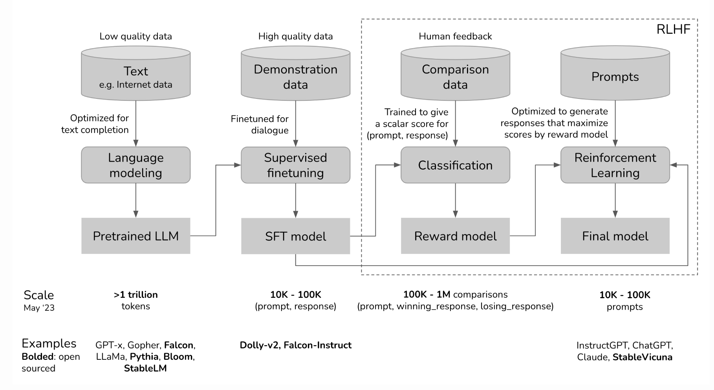

# Development of LLM

大模型的开发通常分为这三步：
* **预训练**：在大量的数据上进行无监督（半监督）训练，该过程可以看作LLM编码了语言统计信息，给定上文，LLM能够按照概率采样填写下文（completion model）。由于数据集的质量不高，此时的LLM可以看作一个不受控制的怪物，没有是非观，输出的文本可能不符合用户预期或者伦理道德（Garbage in Garbage out）。
* **监督微调**：为什么要监督微调（SFT）呢？如果直接用预训练后的completion model，会出现下面的结果：

    `输入：怎么做西红炒蛋`
    
    `回答1：给孩子吃最健康？`
    
    `回答2: ？西红柿炒蛋制作分为一下步骤：...`

    completion model的输出只是在模仿训练数据，模型的输出并不符合用户的期望，监督微调的目标是优化completion model 生成用户期望的答案（注意这个答案不一定对、或者不一定最优）。 
* **RLHF**：SFT使得LLM能够生成看上去合理的回答，但是并没有告诉模型哪个回答是合理的，哪个是正确的。RLHF的目的是用一个打分模型（Scoring function）告诉模型哪个回答好，哪个不好！

下面将给出这三个步骤的详细介绍：

**1. Pretraining for Completion**
任务
模型损失函数
PPL
模型参数量计算

**2. Supervised Fine-Tune for Dialogue**
Demonstration Data （Prompt，Response）

**3. RLHF for Alignment**
Comparasion Data （Prompt，Response, Score）

https://huyenchip.com/2023/05/02/rlhf.html

https://mp.weixin.qq.com/s/_Hg8k-uijw8ntACiiWnhiw