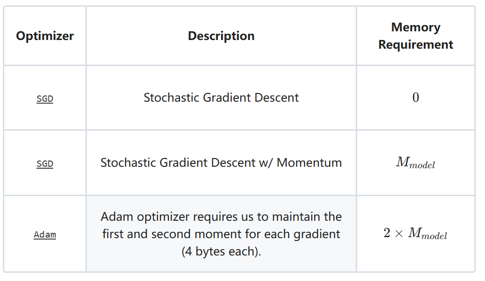
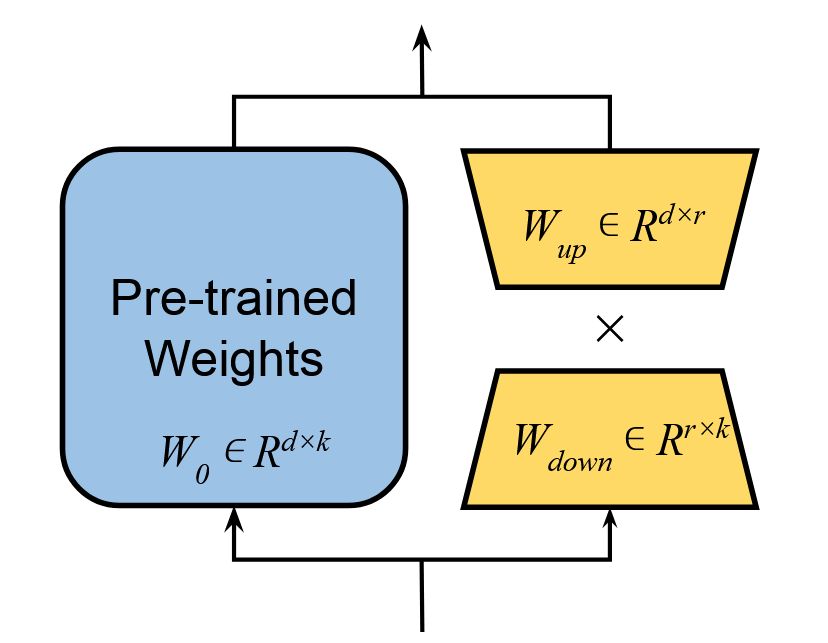

# 分布式训练技术

## Pytorch分布式基础

基础--https://github.com/xuqi220/pytorch-distributed-training

GPT2复现--https://github.com/xuqi220/GPT2

## DeepSpeed
pytorch提供的分布式计算可以有效利用多GPU资源，但是还是不够高效，由于模型在训练过程中会消耗大量的资源，还是会出现Out of Memory 的问题。以Transformer为例模型训练过程内存的占用来自哪里呢：

1. **模型参数**：存储Transformer的Embedding矩阵、Q、K、V矩阵等等。
2. **优化器**：一些效果较好的优化器会为每个参数存储状态例如`Adam`
  

3. **梯度**：需要为模型每个参数存储梯度值
4. **中间过程值**：在前向过程中需要存储中间过程值，例如相关性分数矩阵、Decoder Layer之间的输入于输出等。

    **Deepspeed就是针对1、2、3来进行优化的。**
* DeepSpeed基础

* DeepSpeed实践

* 参考
  

# 高效微调技术(PEFT)

## Additive PEFT

## Selective PEFT

## Reparameterization PEFT

### Lora
* 介绍
  
    
  
  对于预训练模型中参数矩阵 $W_0\in R^{d\times k}$，Lora 引入了两个矩阵 $W_{up}\in R^{d\times r}$ 和 $W_{down}\in R^{r\times k}$，其中 $r\ll min(k,d)$。计算过程如下：

    $$H_{out}=W_0H_{in}+\frac{\alpha}{r}\Delta W H_{in} = W_0H_{in}+ \frac{\alpha}{r}W_{up}W_{down}H_{in}$$
    
    其中， $H_{out},H_{in}$ 分别表示输出和输入; $\alpha$ 表示缩放因子（scaling factor）。训练过程中， $W_{down}$ is initialized using a random Gaussian distribution, while $W_{up}$ is initialized to zero, ensuring that $\Delta W$ initially holds a value of zero. $W_0$ 不做更新， $W_{up}, W_{down}$ 更新。
* 问题
  
  1.  $W_{down}$ $W_{up}$ 初始化问题？
   https://zhuanlan.zhihu.com/p/1915822821
* 实践
  
  [法律大模型微调](https://github.com/xuqi220/QLaw)
  

## Hybrid PEFT

## Reference
[Parameter-Efficient Fine-Tuning for Large Models: A Comprehensive Survey](https://openreview.net/forum?id=lIsCS8b6zj)
