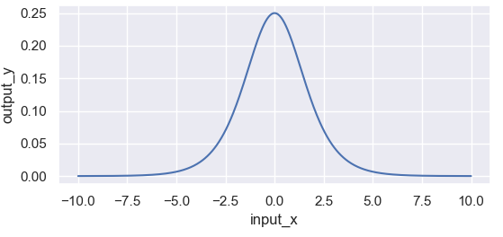
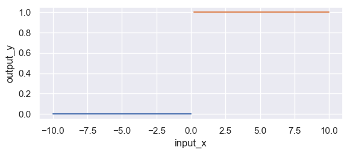
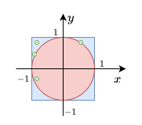

# 深度学习基础
## 一、激活函数
为什么要在网络中引入激活函数？如果不引入激活函数那么我们的网络是这个样子的 $f(x)=A(B(CX))=ABCX=DX,ABC=D$ 。那么，我们的神经网络的就变成了一个线性函数，是空间中的一个超平面，大大限制了神经网络的拟合能力。激活函数就是给神经网络引入非线性，使得神经网络可以拟合各种复杂函数。那么任何激活函数可以随便选择吗？

### (1) Sigmoid
* 函数公式：

$$sigmoid(x)=\frac{1}{1+e^{-x}}$$


* 导数公式：

$$sigmoid^{'}(x)=sigmoid(x)(1-sigmoid(x))$$



* 优点
    * 函数平滑、易于求导
    * 可直接作为分类模型的输出

* 缺点
    * 计算量大，包含幂运算，以及除法运算；
    * sigmoid 导数的取值范围是 [0, 0.25]，最大值都是小于 1 的，反向传播时又是"链式传导"，经过几次相乘之后很容易就会出现梯度消失的问题，不利于模型加深；
    * sigmoid 的输出的均值不是0（即zero-centered），这会导致当前层接收到上一层的非0均值的信号作为输入，随着网络的加深，会改变数据的原始分布，不利于模型的收敛。

### (2) Tanh
Tanh激活函数的公式为：

$$Tanh(x)=\frac{e^x-e^{-x}}{e^{x}+e^{-x}}=1-\frac{2}{e^{2x}+1}$$


其导数为：

$$Tanh^{'}(x)=1-(Tanh(x))^2$$


从结果我们发现 $tanh$ 和 $sigmoid$ 的函数及其导数的图像是非常相似的，不同的是前者函数取值范围为 $[-1,1]$,解决了 sigmoid 函数输出的均值不是0（zero-centered）的问题； 前者导函数取值的范围比后者要大，一定程度上缓解了梯度消失的现象。但是缺点也明显：**幂运算导致计算量大**


### (3) ReLU
ReLU 全称为 Rectified Linear Unit，即修正线性单元函数。该函数的公式比较简单，相应的公式和图像如下表所示。
* 函数公式

$$ReLU(x)=\begin{cases}  
0 & if & x \leq 0\\
x & if & x > 0 
\end{cases}$$


* 导函数公式

$$ReLU'(x)=\begin{cases}  
0 & if \; x \leq 0\\
1 & if \; x > 0 
\end{cases}$$



* ReLU函数以及其导数的计算公式非常的简单
* 当 $x<0$, ReLU导函数直接将导数置为0，类似dropout，这在一方面能够产生稀疏矩阵减少一些特征的干扰，提升模型的鲁棒性；但是直接直接将导数置为0（不加任何策略）可能会导致一些神经元无法有效更新，导致直接坏死。
* ReLU 的输出不是 0 均值的，这个和 sigmoid 类似。

### (4) Leaky ReLU

函数公式：

$$Leaky \operatorname{ReLU}(x)=\left\{\begin{array}{ll}0.01 x & \text { if } z \leqslant 0 \\ z & \text { if } z>0\end{array}\right\}$$

导数公式：


### (5) ELU（指数线性单元）
$$\operatorname{ELU}(x)=\left\{\begin{array}{ll}x, & x>0 \\ 
\alpha(e^x-1), &  x\leqslant0
\end{array}\right\}$$

### (6) GELUs (Gaussian Error Linear Units) 

### (7) Swish (Self-Gated Activation Function)

### (8) Silu (Sigmoid Linear Unit)

函数公式：

$$silu(x)=x*sigmoid(x)$$


导函数公式：

$$silu^{'}(x)=sigmoid(x)(1+x-x*sigmoid(x))$$


## 二、损失函数


## 三、采样算法
## 蒙特卡洛算法

#### 例子1:估计圆周率的值

如下图所示，从正方形中随机均匀抽取点$(x,y)$，那么$(x,y)$落在圆内的概率是多少？



圆的面积： $S_c = \pi r^2=\pi$ 

正方形的面积： $S_q = 2^2=4$ 

概率： $P = \frac{\pi}{4}$ 

假设我们采样了 $n$ 个点，利用圆的方程 $(x-x_o)^2+(y-y_o)<1$ ，统计后有 $m$ 个点落在圆内，因此我们得到
$$\frac{m}{n}\approx\frac{\pi}{4}=>\pi\approx\frac{4m}{n}$$
根据大数定律，当n的值越大， $\frac{4m}{n}$ 越接近 $\pi$ 。

#### 例子2: 近似求积分（integral）
求函数 $f(x)$ 的定积分 $I=\int^b_af(x)dx$ ，当 $f(x)$ 是一个简单函数，那么我们容易求得其原函数，从而求得其准确的定积分。如果 $f(x)=\frac{1}{1+sin(x)(log_ex)^2}$ 或者是其他复杂函数，怎么求呢？这种情况很难求得其准确值，只能求近似解，蒙特卡洛算法就是一个求得其近似解的可选方法。

步骤1. 从区间[a,b]均匀采样 $n$ 个数值记作 ${x_1,x_2,...,x_n}$ .

步骤2. 计算 $Z_n=(b-a)*\frac{1}{n}\sum_{i=1}^{n}f(x_i)$ 

步骤3. $Z_n$ 可以作为 $I=\int^b_af(x)dx$ 的估计值，当$n$的取值越大 $Z_n$ 越接近真实值 $I$ 

#### 例子3: 近似期望
由于一些复杂函数的解析解是很难得到的（比某随机变量的概率密度函数很复杂，难以得到该随机变量期望的精确解），因此通常用一个近似解代替，近似解虽然不是精确解但是够用了。泰勒展开、蒙特卡洛是统计学习和机器学习中经常使用的近似方法。

$X$： $d$ 维的随机向量

$p(x)$: 概率密度函数（PDF），️以随机向量 $x$ 作为输入，输出其概率。其中 $\int_{x \in X}p(x)dx=1$ 

$f(x)$ :是任意函数，以随机向量 $x$ 作为输入。

期望： $\mathbb{E}_{X}[f(x)]$ 


近似步骤：

* 根据概率密度函数 $p(x)$ ，采样 $n$ 个样本记作 $x_1,x_2,...,x_n$ .

* 计算 $Z=\frac{1}{n}\sum_{i=1}^nf(x_i)$ 

* 将 $Z$ 作为期望 $\mathbb{E}_{X}[f(x)]$

样本数量 $n$ 越大估计结果越准确。

蒙特卡洛算法是利用样本对数据进行估计的算法，其估计结果并不是准确值，得到的结果只是近似值。

## 拒绝采样

## 重要性采样

浅谈Transformer的初始化、参数化与标准化
https://spaces.ac.cn/archives/8620

## 评估指标
### 分类评估
假设我们采样了模型预测结果和真实标签如下：
```python
y_pred = [1,2,3,2] # 预测结果
y_true = [0,2,3,1] # 真实结果
```
混淆矩阵可以为：
```
    0   1   2   3   Total  
TP  0   0   1   1     2
FP  0   1   1   0     2
FN  1   1   0   0     2 
TN  3   2   2   3     10
```
其中第一行为真实标签（0，1，2，3）
* TP（True Positive）：模型将真实标签为正类别，预测为正类别。
* TN（True Negative）：模型将真实标签为负类别，预测为负类别。
* FP（False Positive）：模型将真实标签为负类别，预测为正类别。
* FN（False Negative）：模型将真实标签为正类别，预测为负类别。
1. 准确率
   $$Accuracy=\frac{TP+TN}{TP+TN+FP+FN}$$
   平等的对待每个类别，从总体上衡量模型分类性能
2. 精确率
   $$Precision=\frac{TP}{TP+FP}$$
   该指标的计算分为两种：

   * **macro-average**计算分别计算每个类别的TP和FP，然后得到每个类别的Precision最后求平均。

        ```
               0   1   2   3    
        TP     0   0   1   1   
        FP     0   1   1   0    
        FN     1   1   0   0    
        TN     3   2   2   3   
        Prec  0/0  0  0.5  1
        Rec    0   0   1   1
        ```
        scikit-learn包实现:
        ```python
        print(precision_score(y_pred=y_pred, y_true=y_true, average='macro', zero_division=0.0))
        # 0.375=(0+0+0.5+1.0)/4
        
        print(precision_score(y_pred=y_pred, y_true=y_true, average='macro', zero_division=1.0))
        # 0.625=(1.0+0+0.5+1.0)/4
        
        print(precision_score(y_pred=y_pred, y_true=y_true, average='macro', zero_division=np.nan))
        # 0.5=(0+0.5+1.0)/3
        ```
        参数`zero_division` 用于处理(取代)`0/0`的情况，`np.nan`表示不考虑该类别，该参数默认值为`warn`类似与`zero_division=0.0`但是warning is also raised
   
   * **micro-average** 对所有类别的TP和FP求和，然后根据上式计算Precision。
        ```
            0   1   2   3   Total  
        TP  0   0   1   1     2
        FP  0   1   1   0     2
        FN  1   1   0   0     2 
        TN  3   2   2   3     10
        ```
        scikit-learn包实现与macro-average类似。
3. 召回率
   $$Recall=\frac{TP}{TP+FN}$$
   召回率类似也分为**micro-average**和**macro-average**。
4. F1分数
   $$F1_score=2\times \frac{Acc\times Rec}{Acc+ Rec}$$
    F1分数也分为**micro-average**和**macro-average**。

**micro-average**更偏向于instance较多的类别；**macro-average**平等对待每个类别。在多类别分类任务中，如果每个类别的分类性能都需要被公平评估，macro-average 是更好的选择。


